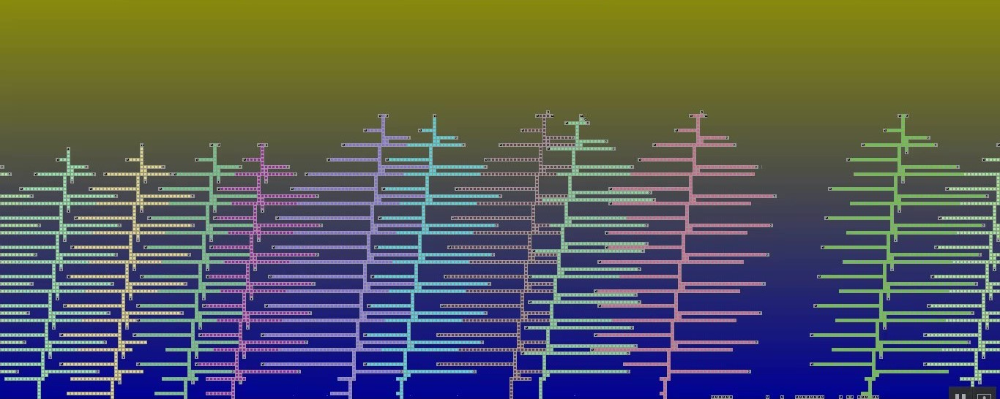

## Get started

Have you ever wondered why trees look like this?

We were inspired by the <a href="https://www.youtube.com/watch?v=WTh-gNZxTM8" target="_blank">foo52ru video</a> and decided to simulate the evolution of trees. To do this, we use genetic algorithms and the PyGame library.

To start, run this commands:

1. ``` git clone https://github.com/world-organization-of-programmmers/Tree-Evolution ```
2. ``` cd Tree-Evolution ```
3. ``` python3 ./main.py ```

### Command line arguments
```
-o : folder name to save genom  |  default TreesGenoms

-i : genome conservation frequency  |   default None

-t : initial number of trees   |   default 10

--cli : non_gui mode  |  default False

--step_mode : step mode    | default False

--width  :  screen width    

--height : screen height

--pixel_size : pixels size 
```


### Examples

``` python3 ./main.py -t 20  -i 100  --width 1200 --height 1000 -o test ```

``` python3 ./main.py  -t 10 --cli --step_mode --pixel_size 15 ```

``` python3 ./main.py -t 20    --width 1200 --height=1000 ```

## Video about the project
[](https://www.youtube.com/watch?v=9t3mAgyzeZM)

<a href="https://docs.google.com/presentation/d/1f2m2CzPWqukrGgyOlo8mzjLpiyaQxQqGLoY1WD0cX3c/edit?usp=sharing" target="_blank">Presentation</a>

## Our results
So, we:
1) programmed the trees and the evolutionary process;
2) widened the world;
3) optimized tree growth and launched our world on powerful graphics processors to see how trees will grow and develop.

34 hours of uninterrupted calculation!

That's the world we got after 2,000,000 iterations:


**Note:** Resulted TreeGenom folder with trees' genoms at each 10,000 iterations you can find <a href="https://drive.google.com/file/d/16ARCMLx0wL62AeH6alIBoESAuu4N308i/view?usp=sharing" target="_blank">here.</a>

In this very simplified world, it is easy to simulate different situations to see how trees behave.

Next, we want to experiment with sprouts to simulate new tree species.

## License
<a href="LICENSE">MIT</a>

All rights belong to their respective owners
